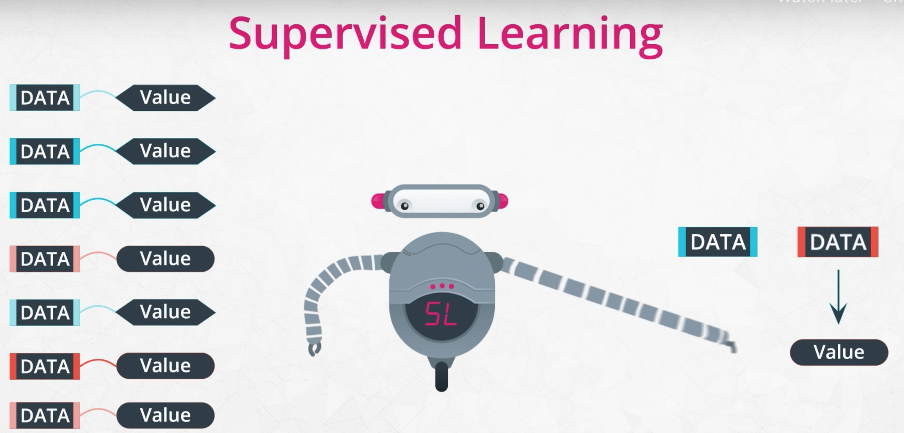

# Recap & Looking Ahead

Throughout this first term, you are going to get very comfortable with a number of machine learning techniques. In this lesson, you gained a glimpse at the perspectives that have collided to create the three tiers of machine learning regularly recognized today:

- Supervised Machine Learning
- Unsupervised Machine Learning
- Reinforcement Machine Learning

## Supervised Machine Learning

Thus far supervised machine learning has gained the most traction in use cases across business applications. Studying labeled data, these techniques can extend patterns to unlabeled data. 

Supervised learning is used for many business applications from spam filters to movie recommendations. We looked at the two broad categories of supervised machine learning:

- Classification
- Regression

Deep learning can be used within supervised machine learning to create techniques that are better at image recognition or identifying when a movie was created based on the video footage.

## Unsupervised Machine Learning

Unsupervised techniques are the second most used in business applications. By learning patterns even when data do not have labels, these techniques can group items together that are likely to be similar. 

Unsupervised techniques are used for business applications from figuring out market segments to again building recommendation engines. There are a lot of ways you can build recommendation engines! But more of that will be shown in term 2.

These two techniques (supervised and unsupervised) will be the main techniques focused on in this term. You will also use deep learning as a supervised learning technique for image recognition.

## Reinforcement Learning

The final type of machine learning, reinforcement learning, has recently been gaining a lot of traction, but still is limited in its use cases related to many business use cases. There are a number of obstacles in training these algorithms, and the approaches are not as streamlined as the other approaches you will see in this term.

With that being said, recent publicity in reinforcement learning has come from [AlphaGo](https://deepmind.com/blog/alphago-zero-learning-scratch/) and [autonomous vehicles](http://cs231n.stanford.edu/reports/2016/pdfs/112_Report.pdf). Additionally, reinforcement learning is often used in [gaming agents like you see in Open AI Gym](https://gym.openai.com/).

This program will not have any applications of reinforcement learning, because their use cases are not often used within common data science applications.

## Looking Ahead

In the upcoming lessons, you will be diving into supervised learning using sklearn (also called scikit-learn). Luis, who used to be a machine learning engineer at Google, will be guiding you through the most common tools and concepts needed to master these techniques!
